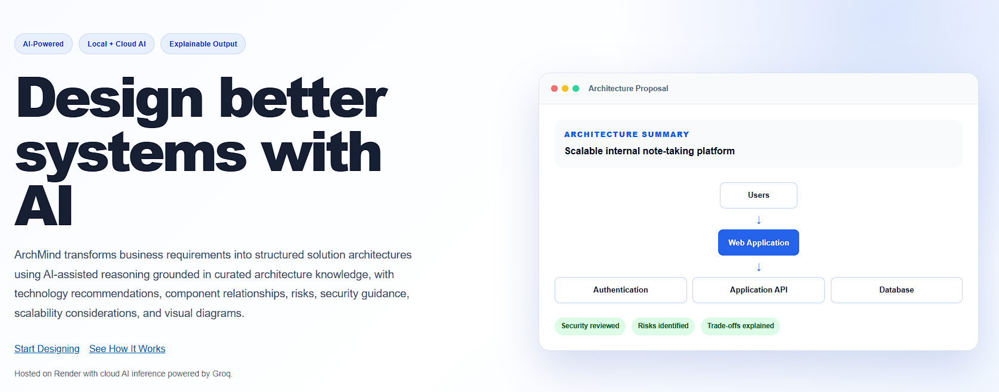
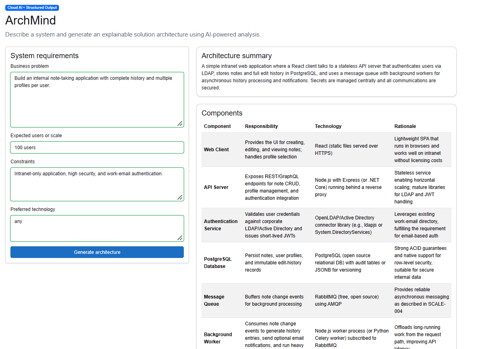

# ArchMind

ArchMind is a local-first AI solution architecture assistant built with .NET and Blazor. It converts business requirements, expected scale, constraints, and optional technology preferences into a structured and explainable architecture proposal.

ArchMind uses a provider-based AI architecture that supports local Ollama inference for development and cloud-hosted AI providers such as Groq for deployment.

The application also includes a lightweight keyword-based retrieval-augmented generation (RAG) pipeline that retrieves relevant architecture knowledge from a curated local knowledge base and provides the retrieved context to the AI agent.

[Live Site](https://archmind-2bc5.onrender.com/)

## Current status

**Functional MVP**

ArchMind currently supports:

- Business requirements and constraint capture
- Neutral technology selection when the preference is `any`
- Provider-based AI configuration
- Local AI inference with Ollama
- Cloud AI inference through Groq
- Structured architecture summaries
- Component responsibilities, technologies, and rationale
- Explicit component relationships
- Security and scalability considerations
- Risks and assumptions
- Mermaid-based architecture diagram generation and rendering
- Curated architecture knowledge base
- Keyword-based knowledge retrieval
- Knowledge-grounded architecture recommendations
- Knowledge source attribution in generated proposals
- Input validation, timeout handling, and controlled AI failure handling

## Screenshots

Add the current screenshots to `docs/images` using these names:

```text
docs/images/archmind-overview.png
docs/images/archmind-diagram.png
```

Then uncomment the image references below:

<!--  -->
<!--  -->

## How it works

```text
User requirements
       |
       v
Blazor Web App
       |
       v
ISolutionArchitect
       |
       +--------------------+
       |                    |
       v                    v
Knowledge Retriever      AI Agent
       |                    |
       v                Ollama / Groq
Local Markdown KB           |
       |                    |
       +--------->----------+
                  |
                  v
       Validated ArchitectureProposal
                  |
          +-------+-------+
          |               |
          v               v
     Structured UI    Mermaid diagram

```

The application uses one focused agent. Deterministic application behavior remains in standard C# services, while the language model handles architecture reasoning and proposal generation.

## Technology stack

- .NET 10
- ASP.NET Core
- Blazor Web App with Interactive Server rendering
- Microsoft Agent Framework
- Microsoft.Extensions.AI
- Ollama
- Groq
- Curated Markdown-based architecture knowledge base
- Mermaid
- xUnit

## Solution structure

```text
ArchMind/
├── src/
│   ├── ArchMind.Web/
│   ├── ArchMind.Application/
│   ├── ArchMind.Domain/
│   └── ArchMind.Infrastructure/
├── tests/
│   └── ArchMind.UnitTests/
├── Knowledge/
├── docs/
└── ArchMind.sln
```
- `Knowledge`: Curated architecture and security knowledge documents used by the retrieval pipeline

### Project responsibilities

- `ArchMind.Web`: Blazor UI, form models, presentation, and dependency composition
- `ArchMind.Application`: Use-case contracts and application exceptions
- `ArchMind.Domain`: Architecture request, proposal, component, and relationship models
- `ArchMind.Infrastructure`: Ollama and Groq AI integrations, knowledge retrieval, and infrastructure services
- `ArchMind.UnitTests`: Unit tests for validation and deterministic application logic

## Prerequisites

For local development with Ollama, install:

- .NET 10 SDK
- Ollama
- Git

Verify the installations:

```bash
dotnet --version
ollama --version
git --version
```
### AI providers

ArchMind supports different AI providers through configuration.

For local development:

```json
{
  "AI": {
    "Provider": "Ollama"
  }
}
```

For cloud deployment :
```json
{
  "AI": {
    "Provider": "Groq"
  }
}
```
## Run locally

### 1. Clone the repository

```bash
git clone <your-repository-url>
cd ArchMind
```

### 2. Download the model

```bash
ollama pull llama3.2
```

### 3. Start Ollama

```bash
ollama serve
```

### 4. Configure the application

Update `src/ArchMind.Web/appsettings.json` if required:

```json
{
  "Ollama": {
    "Endpoint": "http://localhost:11434",
    "Model": "llama3.2",
    "TimeoutSeconds": 180
  }
}
```

### 5. Build and test

```bash
dotnet restore
dotnet build
dotnet test
```

### 6. Run the web application

```bash
dotnet watch --project src/ArchMind.Web
```

Open the URL shown in the terminal and navigate to `/architect`.

## Example input

```text
Business problem:
Build an internal note-taking application with complete history and multiple profiles per user.

Expected users or scale:
100 users

Constraints:
Intranet-only application, high security, and work-email authentication.

Preferred technology:
any
```

When `Preferred technology` is `any`, the agent is expected to select an appropriate stack based on the supplied requirements and explain the rationale. It does not automatically prefer .NET.

## 📸 Screenshots




## Deployment

ArchMind can be deployed using a cloud-hosted AI provider.

The production deployment uses Groq for AI inference, while local development can use Ollama without requiring a paid AI API.

Provider credentials should be configured using the deployment platform's environment variables or secret management facilities.


## Design principles

- Start with one agent and scale only when justified
- Keep model-provider details behind application interfaces
- Prefer strongly typed outputs over free-form text
- Validate AI responses before displaying them
- Treat user input as untrusted data
- Make assumptions, risks, and trade-offs visible
- Avoid premature multi-agent orchestration
- Keep the local development path free of paid services
- Ground architectural recommendations in retrieved knowledge when relevant
- Keep knowledge retrieval deterministic and separate from AI reasoning
- Validate AI-reported knowledge sources against the retrieved source set

## Known limitations

- Architecture quality depends on the selected model
- Generated recommendations still require human review
- Knowledge retrieval currently uses keyword-based matching rather than semantic/vector search
- Retrieval quality depends on lexical overlap between the request and knowledge documents
- Clarification questions are not implemented yet
- Conversation history and saved proposals are not implemented
- The knowledge base is currently maintained as curated Markdown documents

## Roadmap

### Milestone 1: Functional MVP

- [x] Clean .NET solution structure
- [x] Blazor requirements form
- [x] Single AI agent
- [x] Local Ollama provider
- [x] Cloud Groq provider
- [x] Structured architecture proposal
- [x] Architecture relationships
- [x] Security, scalability, risks, and assumptions
- [x] Rendered Mermaid diagram

### Milestone 2: Repository hardening

- [x] Add unit tests for request and response validation
- [x] Add integration tests with a replaceable fake AI implementation 
- [x] Add Docker support for repeatable local setup
- [x] Add screenshots
- [x] Add sample architecture requests
- [x] Add structured logging and health checks

### Milestone 3: Grounded architecture knowledge

- [x] Add a curated architecture knowledge base
- [x] Add keyword-based document retrieval
- [x] Provide retrieved knowledge to the AI agent
- [x] Include sources used for recommendations
- [x] Add architecture-pattern and security-checklist grounding
- [ ] Add document chunking
- [ ] Add embeddings
- [ ] Add semantic/vector retrieval
- [ ] Evaluate hybrid keyword + semantic retrieval


## Testing strategy

The project should separate deterministic tests from model-dependent tests.

### Unit tests

Test without Ollama:

- Request validation
- Response validation
- JSON extraction and deserialization
- Constraint checks
- Empty and malformed model responses

### Integration tests

Run separately when an AI provider is available:

- Agent connectivity
- Structured response generation
- Cancellation and timeout behavior
- End-to-end request-to-proposal flow

Model-dependent tests should verify structure and invariants rather than exact wording.
Provider-specific integration tests can be run against Ollama locally or a configured cloud provider.

## Security notes

- Do not commit secrets or environment-specific credentials
- Validate and limit all user-controlled text
- Apply request timeouts and cancellation
- Do not execute generated Mermaid or model output as arbitrary code
- Review generated technology and security recommendations before implementation
- Use server-side execution for model access

## Contributing

This repository is currently a personal portfolio project. Issues and constructive suggestions are welcome once the repository is made public.

## License

Add a license before publishing the repository. The MIT License is suitable if the intention is to allow reuse with attribution.

## Acknowledgements

- Microsoft Agent Framework
- Ollama
- Mermaid
- .NET and Blazor
